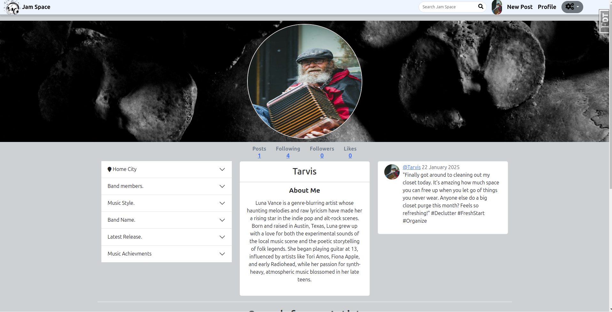
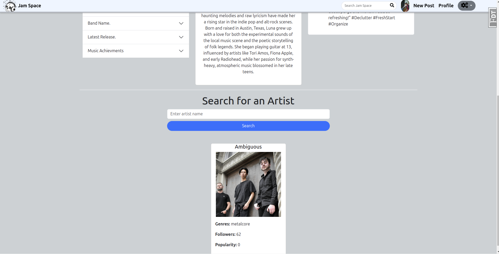
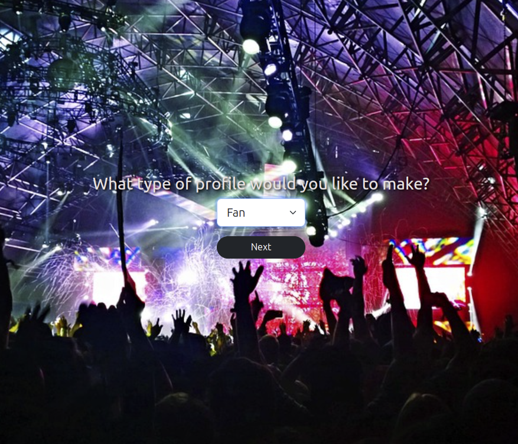

# Jam Space

### Jam Space is a music lovers hub where organizers, musicians and fans can connect and share their musical journey.
 
#### Jam Space:

#### The focus here isn't to create another social media app, but to cater to those who see music as essentail to life as water
#### Every user has access to a search form where they can look up and view details about their favorite artists using the Spotify API

#### App Features Include:
* upon registering for Jam Space a user will be asked which type of account they would like to create. This will change the users experience depending on thier choice.

### Image of one of the possible options given to a user

* The profile of a user will contain different fields including:
	* \# Favorite genre - Fan profile
	* \# Most memorable concert experience - Fan profile
	* \# Venue capacity - Organizer profile
	* \# Organization name - Organizer profile
	* \# Band members - Musician profile
	* \# Latest release - Musician profile
    * \# Just to name a few.

* Fans, musicians and Organizers can interact with one another just as you would expect from any social media platform:
	* Secure login 
	* Make posts 
	* like posts
	* follow others
	* User friendly UI

#### Resources Used:

* Spotify API: [https://developer.spotify.com/documentation/web-api](https://developer.spotify.com/documentation/web-api)

#### Technology Used:
* Flask
* Python
* BeautifulSoup
* Bootstrap
